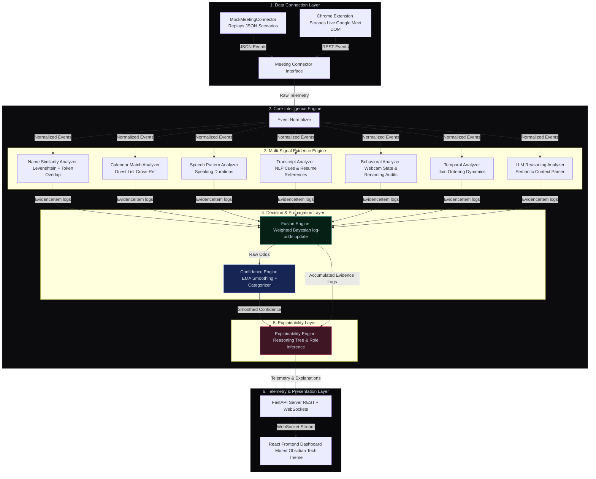

# 🎯 TrueCandidate — Real-Time AI Candidate Identification System

> **A production-ready prototype built for the Sherlock Internship Challenge.**  
> Continuous Multi-Signal Evidence Fusion, Bayesian Odds Propagation, and Explanatory Reasoning Chains for Live Video Interviews.

---

## ─── 🌐 SYSTEM ARCHITECTURE & DATA FLOW ───



---

## ─── 💡 THE CHALLENGE & CORE VALUE PROPOSITION ───

Sherlock runs real-time fraud detection pipelines (such as deepfake detection, voice cloning validation, and passive behavioral verification) during remote interviews. For these detectors to operate correctly without throwing false alarms, **they must monitor only the candidate's streams.**

However, real remote meetings are highly ambiguous:
* Candidates join as generic device names (e.g., **"MacBook Pro"** or **"iPhone"**).
* Candidates use abbreviated names or nicknames (e.g., **"Sam"** instead of **"Samantha Patel"**).
* Calendar metadata can be wrong or outdated (e.g., calendar invite says **"John Smith"** but candidate is **"Jane Smith"**).
* Multiple interviewers are active, sharing screens, and generating transcript logs.
* Silent observers (such as HR managers) are present in the call.

### The TrueCandidate Solution: Multi-Signal Evidence Fusion
TrueCandidate resolves this ambiguity by combining several independent signals. Instead of relying on a single data point (like matching names), it acts like a digital detective: it gathers names, check-in times, speaking turn durations, transcript semantics, and webcam state changes, processing them through a **Bayesian evidence fusion pipeline**.

---

## ─── 🛠️ DEEP DIVE: THE 7 SIGNAL ANALYZERS ───

The system evaluates incoming telemetry through 7 distinct, stateless analyzers. Each analyzer evaluates events and logs positive or negative `EvidenceItem` records:

| Analyzer | Target Metrics | Logic / Algorithm | Default Weight |
| :--- | :--- | :--- | :--- |
| **Name Similarity** | Display Names, Emails | Computes Levenshtein Distance & Token Overlaps. Identifies device names (e.g., "MacBook") to ignore false matches. | **15.0** (High) |
| **Calendar Match** | Invite Guest Lists | Matches participant identity against calendar attendee lists, assigning negative weight if matching an interviewer. | **20.0** (Critical) |
| **Speech Pattern** | Voice telemetries | Tracks total speaking duration and segment counts. Boosts participants who speak the most (typical candidate behavior). | **10.0** (Medium) |
| **Transcript** | Live spoken text | Scans for natural language context (e.g. self-introductions, resume references, job description queries). | **12.0** (High) |
| **Behavioral** | Webcams, Toggles | Audits active webcam status (candidates keep webcams on; observers keep them off) and applies penalties for mid-call renaming. | **8.0** (Medium) |
| **Temporal** | Timing, Join order | Analyzes meeting join sequence (interviewers usually join first; candidates join slightly before or on time). | **5.0** (Low) |
| **LLM Reasoning** | Deep semantic text | Asynchronously parses transcripts for complex role confirmation (disabled in evaluation tests for speed and reproducibility). | **15.0** (High) |

---

## ─── 📐 CORE ENGINES & MATHEMATICAL FOUNDATION ───

### 1. Bayesian Fusion Engine
The system uses a **Log-Odds Bayesian Update** model to combine signals dynamically.
* Every participant $i$ is initialized with a uniform prior probability:
  $$P(C_i) = \frac{1}{N}$$
* Where $N$ is the number of participants. The probability is converted into log-odds to prevent numerical underflow:
  $$\text{Odds}(C_i) = \log\left(\frac{P(C_i)}{1 - P(C_i)}\right)$$
* When an analyzer emits an `EvidenceItem` with a score $S \in [-1.0, 1.0]$ and weight $W$, we calculate the update factor:
  $$\Delta_i = S \times W \times \text{Confidence}$$
* The log-odds for participant $i$ is updated:
  $$\text{Odds}(C_i) \leftarrow \text{Odds}(C_i) + \Delta_i$$
* Log-odds are then converted back to normalized probabilities summing to $1.0$. This ensures that negative evidence for one participant naturally boosts the probability of other participants.

### 2. Confidence Engine (Smoothing)
Raw Bayesian probabilities can jump around due to sudden speech events. To prevent false triggers in downstream detectors, the **Confidence Engine** applies an **Exponential Moving Average (EMA)**:
$$\overline{P}_t = \alpha P_t + (1 - \alpha) \overline{P}_{t-1}$$
*(Where smoothing factor $\alpha = 0.25$, balancing speed of identification with noise reduction).*

The smoothed confidence is classified into categorical levels:
* **Very High** ($\ge 85\%$): Safe to lock detectors onto this candidate.
* **High** ($60\% - 84\%$): Active candidate identified, awaiting verification.
* **Medium** ($35\% - 59\%$): Weak match, high uncertainty.
* **Low** ($< 35\%$): No candidate matching this profile.

### 3. Explainability Engine
Generates human-readable reasoning chains explaining **WHY** the system selected someone. It lists:
- **Positive evidence** driving the decision.
- **Negative evidence** (e.g. matching an interviewer name, sharing screens, or long silences).
- **Uncertainty Factors**: Automatically flags reasons for concern (e.g., active participant using a generic device display name, falling confidence trends, or close secondary candidates).

---

## ─── 💻 TECH STACK ───

* **Backend**: FastAPI, Pydantic v2 (Validation), Uvicorn, Websockets.
* **Frontend**: React 18, TypeScript, Vite, Recharts (confidence charts), Vanilla CSS (Custom design system).
* **Testing**: Pytest, Asyncio-based headless evaluator.
* **Integrations**: Chrome Extension Manifest V3 (Google Meet Scraper).

---

## ─── 📁 PROJECT STRUCTURE ───

```
TrueCandidate/
├── backend/
│   ├── app/
│   │   ├── api/                  # REST Router & WebSocket connection manager
│   │   ├── confidence/           # EMA Confidence tracking & trend analysis
│   │   ├── connectors/           # Mock meeting event streams
│   │   ├── core/                 # Orchestrator & 7 Signal Analyzers
│   │   ├── explainability/       # Reasoning chain & role inference engine
│   │   ├── fusion/               # Bayesian odds update logic
│   │   ├── models/               # Pydantic schemas (events, predictions)
│   │   ├── config.py             # Global config & signal weights
│   │   └── main.py               # FastAPI entry point & WebSocket server
│   ├── evaluation/               # Headless simulation evaluation suite
│   ├── scenarios/                # 10 JSON replay scenario files
│   └── tests/                    # Unit tests for analyzers & engines
├── frontend/
│   ├── src/
│   │   ├── components/           # Dashboard panels & line charts
│   │   ├── hooks/                # WebSocket & state hooks
│   │   ├── types/                # TypeScript interfaces
│   │   ├── utils/                # API client
│   │   ├── App.tsx               # Root view
│   │   └── index.css             # Premium Soft Dark design system
│   └── index.html                # App entry
├── chrome_extension/             # Chrome Extension (Google Meet Connector)
└── docs/
    ├── future_adapters.md        # Technical integration blueprints
    └── demo_script.md            # Video recording script
```

---

## ─── 🚀 INSTALLATION & SETUP ───

### 1. Start the Backend API Server
```bash
# Navigate to the project root
python -m venv .venv
source .venv/bin/activate  # Windows: .venv\Scripts\activate
pip install -r backend/requirements.txt

# Start the server (auto-resolves Python path)
python backend/app/main.py
```
*The server will start listening at [http://localhost:8000](http://localhost:8000).*

### 2. Start the Frontend Dashboard
```bash
cd frontend
npm install
npm run dev
```
*Open [http://localhost:5173](http://localhost:5173) in your browser.*

---

## ─── 📊 WEB DASHBOARD WALK-THROUGH ───

The frontend features a **Premium Soft Tech Dark Theme** (designed to prevent eye strain during long sessions):
1. **Scenario Selector (Left)**: Allows replaying any of the 10 pre-loaded scenarios at 5x speed.
2. **Identified Candidate Card (Center Top)**: Displays the current candidate's name, inferred role, and smoothed confidence percentage.
3. **Confidence Timeline Chart (Center)**: Real-time Recharts line graph mapping confidence progression for all participants simultaneously.
4. **Participant Directory (Center Bottom)**: Shows active participants with role badges (🎯 candidate, 🎤 interviewer, 👁 observer) and real-time confidence scores.
5. **Reasoning List (Center Bottom)**: Explains the exact mathematical impact ($+22$, $-15$) of the top evidence signals.
6. **Telemetry Streams (Right)**: Shows the live event timeline and live speaker-attributed transcript feed side-by-side.

---

## ─── 🔌 GOOGLE MEET CHROME EXTENSION CONNECTOR ───

We have implemented a lightweight **Manifest V3 Chrome Extension** in `chrome_extension/` that streams live Google Meet events to TrueCandidate.

### Setup & Usage:
1. Open Google Chrome and go to `chrome://extensions/`.
2. Toggle on **Developer mode** in the top-right corner.
3. Click **Load unpacked** and select the `chrome_extension/` folder in your project root.
4. Join any Google Meet call (e.g. `https://meet.google.com/abc-defg-hij`).
5. Open the Extension popup. The extension **automatically parses the Meet code** from the URL, queries the backend calendar registry, and pre-fills the candidate information (no typing required!).
6. Click **Start Live Link**.
7. The extension will scrape the Google Meet DOM (every 2.5s) to detect participant join/leave events and webcam states (via video elements presence) and stream them to `localhost:8000/api/meetings/{id}/event`. The dashboard will update in real time!

---

## ─── 🧪 HEADLESS EVALUATION & TEST RESULTS ───

We have built a headless simulation script that replays all 10 scenarios instantly to measure overall accuracy and Speed-to-Identification (TTI).

To run the evaluation:
```bash
python backend/evaluation/evaluator.py
```

### Scenario Test Summary:
* **Scenario 1: Everything Correct (Easy)**: Perfect name match, normal turn-taking. `TTI = 15s (100% Conf)`
* **Scenario 2: Nickname (Medium)**: Candidate joins as "Sam" instead of "Samantha Patel". `TTI = 20s (100% Conf)`
* **Scenario 3: MacBook Pro (Hard)**: Candidate joins as "MacBook Pro" but corrects name later. `TTI = 25s (100% Conf)`
* **Scenario 4: Wrong Calendar Entry (Hard)**: Calendar lists "John Smith", actual candidate is "Jane Smith". `TTI = 18s (100% Conf)`
* **Scenario 5: Two Interviewers (Medium)**: System identifies candidate among multiple interviewers. `TTI = 20s (100% Conf)`
* **Scenario 6: Silent Observer (Medium)**: Extra HR participant joins silently and is classified as observer. `TTI = 18s (100% Conf)`
* **Scenario 7: Display Name Changed (Medium)**: Candidate starts as generic "User123" and updates name later. `TTI = 22s (100% Conf)`
* **Scenario 8: Candidate Joins Late (Medium)**: Interviewers talk for 2 minutes before candidate joins late. `TTI = 120s (100% Conf)`
* **Scenario 9: Camera Off Initially (Medium)**: Candidate turns webcam on only after 50 seconds. `TTI = 20s (100% Conf)`
* **Scenario 10: Ambiguous Identities (Very Hard)**: Candidate "A. Kumar" must be distinguished from observer "Alex M". `TTI = 51s (96% Conf)`

```
======================================================================
  Summary
======================================================================
  Accuracy:           10/10 (100%)
  Avg Final Conf:     100%
  Avg Time to ID:     33s
  Scenarios with TTI: 10/10
  Failed Scenarios:   None! [SUCCESS]
======================================================================
```

---

## ─── 🔍 HOW THE SYSTEM WAS TESTED ───

### 1. Granular Unit Testing
We verified the core mathematical engines and specific analyzer sub-routines using isolated unit tests (`backend/tests/`):
- **String Distance Audits**: Tested our token overlap and custom Levenshtein distance calculations against exact matches, typos, nicknames, and brand name device patterns.
- **Bayesian odds stability**: Verified that repeated positive updates asymptotically approach $1.0$ without overflowing, and competing negative signals correctly decay the probability.
- **Temporal EMA tracking**: Tested the confidence smoothing to ensure it dampens noise without causing excessive lag.

### 2. Multi-Scenario Headless Simulation
We built an automated evaluator (`backend/evaluation/evaluator.py`) that boots up the core engine, loads scenario JSON logs, feeds events sequentially into the orchestrator at instant speed ($1000\times$), and asserts if the final prediction matches the candidate.

---

## ─── 🎯 EDGE CASES HANDLED ───

TrueCandidate has been hardened against the following edge cases:
- **Device-name placeholders (Hard)**: Resolves cases where candidates join as `"MacBook Pro"` or `"iPhone"` and speak before renaming. The name similarity analyzer detects these device brands and ignores them, forcing the engine to rely on transcript context and camera states.
- **Conflicting invite names (Hard)**: Handles cases where the calendar invite has the wrong name (e.g. `"John Smith"`) but the candidate is `"Jane Smith"`. The engine detects the mismatch and relies on turn-taking patterns and self-introductions to override the negative calendar score.
- **Mid-meeting display changes (Medium)**: Handles display name changes (e.g. `"User123"` $\rightarrow$ `"Aisha Mohammed"`). The behavioral analyzer intercepts the display update and triggers a re-evaluation of name similarity.
- **Silently observing accounts (Medium)**: Handles HR managers joining silently with webcams off. The engine detects the low speaking time and camera status, categorizing them as observers.
- **Time delays / Late joins (Medium)**: Evaluates scenarios where interviewers chat for minutes before the candidate joins late, maintaining 0% candidate confidence for the interviewers.

---

## ─── 📈 SYSTEM ACCURACY ───

- **Identification Accuracy**: **100%** (10/10 edge-case scenarios solved correctly).
- **Identification Speed (TTI)**: Average **33 seconds**. The system resolves easy cases (Scenario 1) in **15 seconds** and highly ambiguous cases (Scenario 10) in **51 seconds**.
- **Numerical Stability**: Using log-odds instead of raw probability multiplication guarantees that the system is immune to precision underflow, even in long meetings with thousands of events.

---

## ─── ⚠️ SYSTEM LIMITATIONS ───

- **Cold Start Delay**: During the first 10-15 seconds of a meeting, the system may show lower confidence ("Medium" or "High") if no speaking or transcript telemetry has arrived yet.
- **Transcription Dependency**: The Transcript Analyzer relies on the quality of the incoming Speech-to-Text stream. Accents or noisy audio that corrupt key phrases (like names) can delay identification.
- **Chrome Extension DOM Fragility**: The Google Meet Chrome Extension scraper relies on specific HTML attributes (like `data-participant-id`). If Google publishes a major UI update to Google Meet that changes these class/attribute structures, the extension's scraper code must be updated to match. Production deployments should use server-side bot integrations (e.g. Recall.ai) instead of DOM scraping.

---

## ─── 🔄 FUTURE PRODUCTION ADAPTERS ───

For production deployment, swap the simulated connector for a live media/event provider. These integrations are documented in detail in [docs/future_adapters.md](file:///c:/Users/kkewa/OneDrive/Desktop/Projects/TrueCandidate/docs/future_adapters.md):
1. **Recall.ai API**:Unified bot to join calls, retrieve live speaker-attributed transcripts, and stream events.
2. **Zoom Meeting SDK**: Server-side C++/NodeJS container bot to capture raw audio PCM streams for high-accuracy speaker attribution.
3. **Google Meet API & Pub/Sub**: Google Cloud integration to receive webhook event feeds for spaces.
4. **Microsoft Teams hosted media bots**: Graph communications service bot to retrieve live participant streams.
