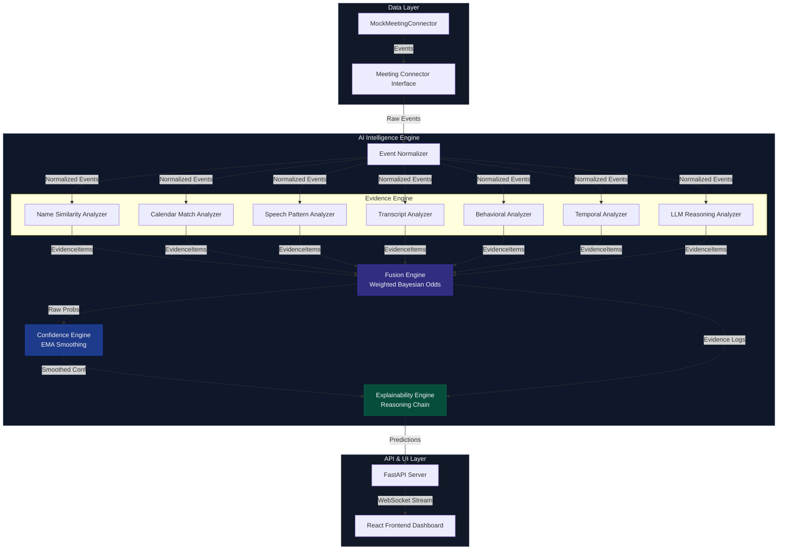

# TrueCandidate — AI-Powered Interview Candidate Identification System

TrueCandidate is a production-quality real-time candidate identification system designed for Sherlock. It monitors live meeting events (participant activity, audio/speaking durations, webcams, live transcripts, and calendar metadata) to continuously compute a confidence score for which participant is the actual candidate, generating live human-readable reasoning chains that explain its decisions.

---

## 1. Problem & Challenge

Sherlock operates fraud detectors (deepfake, voice cloning, behavioral analysis) that must run **exclusively** on the interview candidate's streams. Misidentifying the candidate breaks the downstream pipeline. Real-world meetings present numerous ambiguities:
- Candidates joining as `MacBook Pro`, `iPhone`, or generic names.
- Candidates using nicknames (e.g. `Sam` vs `Samantha Patel`).
- Incorrect or mismatched calendar invite names.
- Multiple interviewers speaking and sharing screens.
- Silent HR observers.
- Mid-meeting display name changes, camera toggles, or network rejoins.

---

## 2. Architecture & Design

### Architecture Diagram


### Connector-Based Design
The primary architecture is **connector-based**. We explicitly do not build a browser extension or platform integration as the primary system. Instead, the AI engine consumes normalized participant events from a `MeetingConnector` interface. This ensures that the engine is completely platform-independent and can support Zoom, Microsoft Teams, Google Meet, or Recall.ai bots by swapping the adapter.

### Core Algorithms
1. **Multi-Signal Evidence Fusion**: 7 independent signal analyzers evaluate incoming normalized events and output `EvidenceItem` logs containing scoring (-1.0 to 1.0), weight (importance), and human-readable reasoning.
2. **Bayesian Odds Update**: The Fusion Engine translates evidence scores into log-likelihood updates and propagates them across participants using a Bayesian update rule.
3. **Temporal Smoothing**: A calibrated Exponential Moving Average (EMA) prevents wild confidence spikes, ensuring smooth transitions.
4. **Explainability Engine**: The system identifies the positive and negative signals driving the candidate selection, lists current uncertainty factors (e.g. close second prediction, falling trends, device display names), and exposes this real-time explanation on the dashboard.

---

## 3. Tech Stack

- **Backend**: FastAPI (Python 3.11/3.12), Pydantic v2 (type validation), Uvicorn, Websockets.
- **Frontend**: React 18, TypeScript, Vite, Recharts (confidence graphs), Vanilla CSS (Design system).
- **Evaluation & Tests**: Pytest, asyncio evaluation suite.

---

## 4. Project Structure

```
TrueCandidate/
├── backend/
│   ├── app/
│   │   ├── api/                  # REST API & WebSocket handlers
│   │   ├── config.py             # App configurations & signal weights
│   │   ├── connectors/           # Meeting Connector adapters (Mock)
│   │   ├── core/                 # Engine orchestrator & 7 signal analyzers
│   │   ├── explainability/       # Reasoning & role inference generator
│   │   ├── fusion/               # Bayesian evidence fusion engine
│   │   ├── confidence/           # EMA confidence tracking
│   │   └── models/               # Pydantic data schemas
│   ├── evaluation/               # Headless simulation evaluation script
│   ├── scenarios/                # 10 JSON replay scenario files
│   └── tests/                    # Backend unit tests
├── frontend/
│   ├── src/
│   │   ├── components/           # Dashboard panels & charts
│   │   ├── hooks/                # WebSocket & state hooks
│   │   └── types/                # TS type definitions
│   └── index.html                # Main html entry
├── docs/
│   └── future_adapters.md        # Technical blueprint for real integrations
└── README.md
```

---

## 5. Installation & Setup

### Prerequisites
- Python 3.10+
- Node.js 18+

### 1. Run the Backend
```bash
# Clone the repository
git clone https://github.com/Sahilkewat80085/TrueCandidate.git
cd TrueCandidate

# Setup python environment
python -m venv .venv
source .venv/bin/activate  # On Windows: .venv\Scripts\activate

# Install requirements
pip install -r backend/requirements.txt

# Run server (runs on http://localhost:8000)
python backend/app/main.py
```

### 2. Run the Frontend
```bash
cd frontend
npm install
npm run dev  # runs on http://localhost:5173
```

---

## 6. Simulation & Scenarios

The backend comes pre-packaged with **10 realistic interview scenarios** that replay automatically at 5x speed for demonstration:

1. **Everything Correct** (Easy): Perfect name match, normal turn-taking.
2. **Nickname** (Medium): Candidate joins as `Sam` instead of `Samantha Patel`.
3. **MacBook Pro** (Hard): Candidate joins as `MacBook Pro` but corrects name later.
4. **Wrong Calendar Entry** (Hard): Calendar lists `John Smith`, actual candidate is `Jane Smith`.
5. **Two Interviewers** (Medium): System identifies candidate among multiple interviewers.
6. **Silent Observer** (Medium): Extra HR participant joins silently and is classified as observer.
7. **Display Name Changed** (Medium): Candidate joins as generic `User123` and updates name later.
8. **Candidate Joins Late** (Medium): Interviewers talk for 2 minutes before candidate joins late.
9. **Camera Off Initially** (Medium): Candidate turns webcam on only after 50 seconds.
10. **Ambiguous Identities** (Very Hard): Candidate `A. Kumar` must be distinguished from observer `Alex M`.

---

## 7. Automated Evaluation

Run the evaluation script to test the accuracy and speed of identification across all 10 scenarios:
```bash
python backend/evaluation/evaluator.py
```

### Results
```
======================================================================
  TrueCandidate — Evaluation Report
======================================================================

  Running: Everything Correct... [PASS] 01_perfect_match: conf=100%, TTI=15s, events=35, evidence=63
  Running: Candidate Uses Nickname... [PASS] 02_nickname: conf=100%, TTI=20s, events=23, evidence=32
  Running: MacBook Pro Display Name... [PASS] 03_macbook_pro: conf=100%, TTI=25s, events=24, evidence=35
  Running: Wrong Calendar Entry... [PASS] 04_wrong_calendar: conf=100%, TTI=18s, events=23, evidence=31
  Running: Two Interviewers... [PASS] 05_two_interviewers: conf=100%, TTI=20s, events=28, evidence=49
  Running: Silent Observer... [PASS] 06_silent_observer: conf=100%, TTI=18s, events=24, evidence=39
  Running: Display Name Changed Mid-Meeting... [PASS] 07_name_change: conf=100%, TTI=22s, events=24, evidence=33
  Running: Candidate Joins Late... [PASS] 08_late_joiner: conf=100%, TTI=120s, events=28, evidence=48
  Running: Camera Off Initially... [PASS] 09_camera_off: conf=100%, TTI=20s, events=26, evidence=28
  Running: Ambiguous Identities... [PASS] 10_ambiguous: conf=96%, TTI=51s, events=28, evidence=53

======================================================================
  Summary
======================================================================
  Accuracy:           10/10 (100%)
  Avg Final Conf:     100%
  Avg Time to ID:     33s
  Scenarios with TTI: 10/10
```

---

## 8. Tradeoffs & Future Work

### Tradeoffs
- **Heuristics vs ML Models**: We opted for a Bayesian Evidence Fusion engine rather than a neural network classification model. This makes the system extremely fast, lightweight, and 100% explainable without requiring offline training datasets.
- **LLM Usage**: The LLM is used strictly asynchronously for transcript reasoning (summarizing and picking context clues) to prevent blocking the real-time event loop.

### Future Work
- Support for **Zoom Meeting SDK** and **Recall.ai** server-side bots (documented in `docs/future_adapters.md`).
- Multi-language support in the Transcript Analyzer.
- Continuous learning of analyzer weights using reinforcement learning from user corrections.
